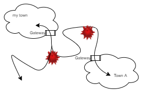

# Markdown

たいしたことはありません．皆さんは，Microsoft Office Wordで文書を書くことがあると思いますが，Windowsメモ帳を使ったことはあるでしょうか．

使ったことがある人は，重いがいろんな装飾のできるWord，軽いが装飾ができないメモ帳という印象かもしれません．

Markdownは，メモ帳での書き方の規則であり，この規則に従うと，それをMarkdown対応のビューワで読むと装飾されるというものです．

実際，今読んでいるこの文書は，Readme.mdというテキストファイルです．
ビューワで読んでいるのできれいに見えていますが，実はテキストファイルをそのまま読んでもまぁまぁきれいです．

Markdownはいろいろできますが，見出しの付け方，ドットリスト，ナンバーリスト，表，引用，ソースコード，リンク，くらいを覚えればいいのではないでしょうか．

## 基本的な文章の書き方

センテンスごとに空行をつけます．

空行をつけないと，テキスト上で改行しても
表示は改行されない

```
空行をつけないと，テキスト上で改行しても
表示は改行されない
```

空行をつければ

大丈夫

```
空行をつければ

大丈夫
```


## 見出し

行頭に`# ほにゃらら`（シャープ，半角スペース，見出しテキスト）で大見出しになります．シャープを増やすごとに見出しが小さくなっていきます．

# 大見出し

## 中見出し

### 少見出し

```
# 大見出し

## 中見出し

### 少見出し
```

## ドットリスト，ナンバーリスト

- こんな
- そんな
- あんな
- どんな

```
- こんな
- そんな
- あんな
- どんな
```

1. ひとつ
2. ふたつ
3. みっつ

```
1. ひとつ
2. ふたつ
3. みっつ
```

## 表

|A|B|C|
|---|---|---|
|1|2|3|
|4|5|6|

```
|A|B|C|
|---|---|---|
|1|2|3|
|4|5|6|
```

## 引用

> 吾輩は猫である
> 名前はまだない

```
> 吾輩は猫である
> 名前はまだない
```

## ソースコード

装飾されないテキストそのままのブロックは，back-quote3つで囲みます．

```py
import numpy as np

a + b = 1
```

```
    ```py
    import numpy as np

    a + b = 1
    ```
```

ブロックでなく，単語の場合は，backquote1つで囲みます．

`sonoda@cis.nagasaki-u.ac.jp`

```
`sonoda@cis.nagasaki-u.ac.jp`
```

## リンク

他のファイルへのリンク，Webアドレス,メールアドレスのリンクは，

[タイトル](/Readme.md)

[おれおれ](sonoda@cis.nagasaki-u.ac.jp)

```
[タイトル](/Readme.md)

[おれおれ](sonoda@cis.nagasaki-u.ac.jp)
```

画像の表示もリンクですが，頭にビックリマークをつけます．



```

```

## 文字強調

あ，*あ*, **あ**, ***あ***, ~~あ~~

```
あ，*あ*, **あ**, ***あ***, ~~あ~~
```


