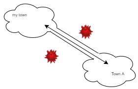
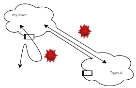

# 学外から学内LANにVLAN接続

ネットワークのお話ですが，普段私たちはLAN（Local Area Network）という城壁都市の中に住んでいて，城壁の外の広大なインターネット(WAN, World Area Network)空間とやりとりするときには，
城門（Gateway）から外出して，直接危険と触れながら仕事を行い，城門から帰ってきます．別の町に行く場合も同じです．


VPNは，まさに抜け道であり，城門(Gateway)ではない場所に，別の町と直接つながった抜け穴を作ります．この抜け穴があると，すなわち城壁の外の危険な世界と直接触れ合わずに，あたかもずっと城壁の中にいるかのように別の町と交流することができます．



ただ一つ注意があります．

別のある町Aへの抜け穴をつなげた場合，城門を完全に閉じることが多いです．すなわち，A町とは完全自由交流ですが，A町以外とは交流できません．至極安全です．これが抜け道利用の原則です．

原則を守るのは至極安全ですが，少し不便ですので，場合によっては元々の城門を閉じないこともできます．A町との交流は抜け穴利用，A町以外との交流は城門利用，ということです．



長崎大学学内ネットワークへの抜け穴の入口は，

```
v-conn.nagasaki-u.ac.jp
```

です．長大IDとパスワードで入ることができます．Cisco社のAnyConnectという通信方法を使っています．

AnyConnectは原則通りの運用ですので，この抜け穴をAnyConnectで利用すると，利用をはじめた瞬間，インターネット世界は自分のPCと長大学内ネットワークだけに限定されます．

そこで，OpenConnectという通信方法を使います．

[OpenConnect](https://www.infradead.org/openconnect/)

[WindowsGUI](https://github.com/openconnect/openconnect-gui/releases)

このソフトウェアの環境変数を設定します．この設定をしたうえでVPNに繋ぐことができます．

|環境変数 | 値 | それ何？ |
|---|---|---|
|CISCO_SPLIT_INC | 1 | # 抜け穴の個数 | 
|CISCO_SPLIT_INC_0_ADDR | 133.45.0.0 | # 長崎大学学内LAN |
|CISCO_SPLIT_INC_0_MASK | 255.255.0.0 | # ネットマスク |
|CISCO_SPLIT_INC_0_MASK_LEN | 16 | # netmaskのビット長 |

windowsの場合，openconnect-GUIをインストールしたのちに，特製バッチコマンド [nuconnect.bat](nuconnect.bat) をダウンロードし，`nuconnect.bat`を起動してください．

windows以外の場合は，openconnectをインストールしたのちに，特製スクリプト [nuconnect.sh](nuconnect.sh) をダウンロードし，以下のように`openconnect`を起動してください．

```
$ sudo openconnect v-conn.nagasaki-u.ac.jp --script=nuconnect.sh
```
