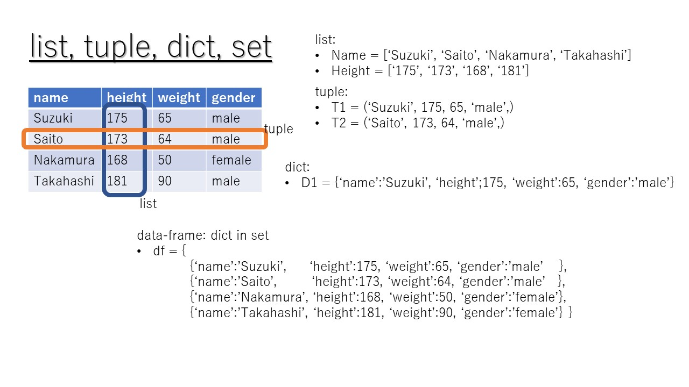

# Pandas

```py
import pandas as pdf
```

## データの読み込み

こういうデータがある．

| A | B | C | D | E | F |
|------|------|------|-------|-------|-----|
| 1    | 0.4  | リンゴ  | 嫌い    | [0,0] | 真   |
| 2    | 1.1  | バナナ  | 好き    | [0.1] | 真   |
| 1 | 0.1 | リンゴ | ふつう | [1,0] | 偽 |
| 3 | 0.8 | すいか | 好き | [1,1] | 真 |

このような表をデータフレームという．

1行目を除いた各行を標本（サンプル）という．サンプルに順序はない．

各列の2列目以降の値は，属性，因子，変数などという．属性に順序はない．

1行目は，各列の値につけた名前で，属性名，因子名，変数名などという．調査・計測の項目である．

標本の数をサンプルサイズという．

サンプルサイズ4つの対象があって，6つの調査・計測項目がある．すなわち値は4x6=24個ある．

各列（縦, カラムcolumns）は，現れうる値の集合が異なるとする（データには表現されておらず，自ら想定しておく）
- A列は，整数値を表示する計測結果であり，集合は無限大範囲（データにあらわれていない整数も出現しうる）
- B列は，小数まで表示する計測結果であり，集合は無限大範囲（データにあらわれていない小数も出現しうる）
- C列は，リンゴ，バナナ，すいか，ぶどうの4つから選ばれる（ぶどうはデータにあらわれていない）．この4つに大小・高低・優劣はない
- D列は，嗜好度で，好き・ふつう・嫌いの3つから選ばれる．好き＞ふつう＞嫌い の順位がある．

現れうる値のことを「水準」という．

これらのデータの性質の違いは尺度（スケール，Scale）という切り口で分類できる．

|尺度|水準の性質|
|---|---|
|名義尺度, nominal scale| 水準の差は，同じか違うか|
|順序尺度, ordered scale| 水準の差は競べられる．優劣・大小・高低|
|間隔尺度, |水準の差は較べられる．加算したもの・減算したものも水準内|
|比尺度, rational scale| 水準の差は比べられる．乗算したもの・除算したものも水準内|

名義尺度と順序尺度のデータは計算できない「質」なので質的データといい，間隔尺度，比尺度のデータは計算できる「量」なので量的データという．

ちなみに，4x6=24個の値がすべて同じ水準内である表をテンソル（多次元配列，行列やベクトルを含む）という．

pythonではデータフレームを次の図のように扱う．



ただし，dict-in-setでは属性ごとの水準をあらわせていないため，pandasというパッケージのDataFrame型を用いる．

また，値がすべて数値であるテンソルは，numpyパッケージのndarray型を用いると数値計算が可能である．

### CSVファイルの読み込み

```py
CSV_FILENAME = "pathto/foo.csv"

df = pd.read_csv(CSV_FILENAME)
```

質的変数の取り扱い
```py
# 名義尺度, nominal
df.A = df.A.astype(pd.CategoricalDtype(categories=[]))
# or
df.A = pd.Sereies(dictA, dtype=pd.Categorical)

# 順序尺度，ordered
df.B = df.B.astype(pd.CategoricalDtype(categories=[], ordered=True))
```

時刻変数の取り扱い
```py
df.C = pd.to_datetime(df.C)


```