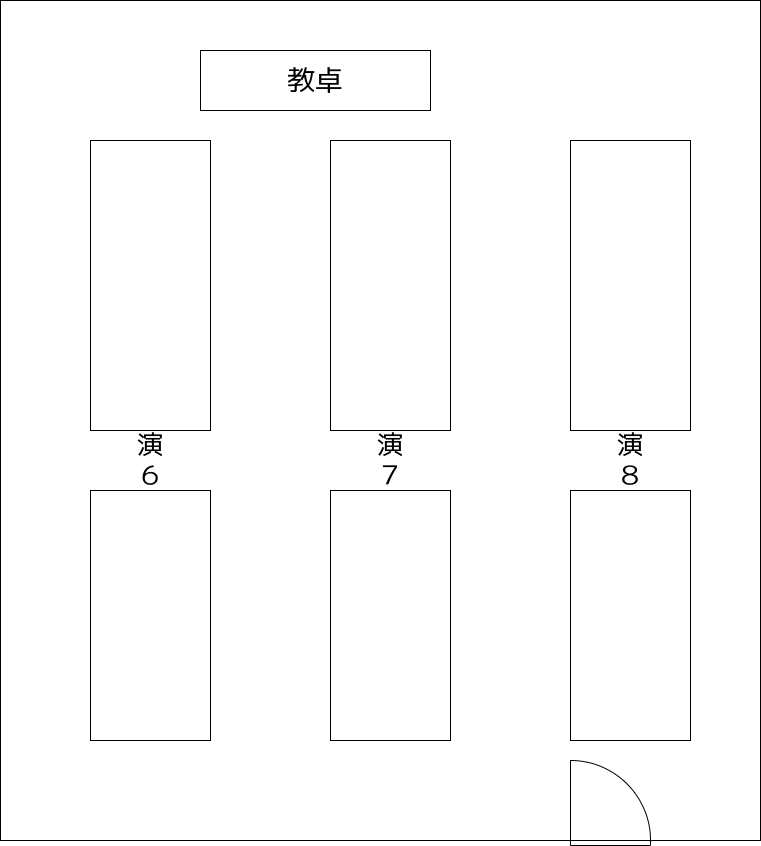

# 演習Ⅱについて

## 体制

- 教員・技術職員(1+3)：薗田　＋　山下，松尾，元島
- TA(8)：喜安研M1(4)　＋　柴田研M1(4)

|TA|名前||TA|名前|
|---|---|---|---|---|
|多0|技術職員foo||演6|三浦＠柴田研|
|多1|木村＠喜安研||演7|本吉＠柴田研|
|多2|小森＠喜安研||演8|山下（惠）＠柴田研|
|多3|山下（翔）＠喜安研||||
|多4|本村＠喜安研||||
|多5|荒木＠柴田研||||

# 部屋割

- [チューターごとの部屋割表](/lodgings.pdf)
- [個人ごとの部屋割表](/lodgings_detail.pdf)



## 演習Ⅱの役割

0. 概論（プログラミングの考え方）の続きと実践
1. 演習Ⅰ（Pytho言語）の復習
2. 演習Ⅲ（C言語）への架け橋

## 開発環境とその他

開発環境は，エディタとコンパイラとデバッガの3つのソフトウェアで構成されます．これらを準備してください．

### IDE: Editor, Compiler, Debuger

エディタについてですが，
- 先ず，エディタ(Editor)とはエディット(Edit,編集)するソフトウェアです．
- 演習Ⅰでは emacs を用いました．
- 従来からエディタと云えばemacsかviであり，激しい抗争が行われてきました．
- なぜか？リモートアクセスした外部のマシンの中をいじるにはマウスが使わずにファイルを読み書きできないといけないからです．そういう用途にＣＵＩエディタのemacsとviが強いのです．
- 現在ではリモートアクセスした外部のマシンをマウスで操作可能になりました．そうなるとemacsやviは無骨（無粋；職人堅気）でＧＵＩのエディタのほうが機能がわかりやすく流行ってきています．

コンパイラについては，
- 「コンパイラ」(Compiler)とはコンパイル(Compile，プログラミング言語を機械語に翻訳)するソフトウェアです．
  - 基本的には，完成されたソースコードを受け付けて，実行ファイルを新しく作るソフトウェアです．
    - Pythonはインタプリタ言語といい，ソースコードをブロックごとに逐次的にコンパイルして実行します．実行ファイルを作りません（作っていないように見えるだけ）．
  - 原則的にはコンパイルした環境でしかソフトウェアは動きません．WindowsとMacとUnixではソフトウェアの互換性がありません．
- 演習Ⅱでは演習Ⅰに引き続き Python (version 3 系) を用います．
- ちなみに演習ⅢではＣ言語を用いるので，演習Ⅱの所々で少しおまけでＣ言語も使ってみます．

デバッガについてですが，
- 先ず，「デバッガ」(DeBuger)とはデバグ（De-Bug；バグ（昆虫）つぶし）するソフトウェアです．
- プログラミングにおける障害は，
  1. ソースコードをコンパイルできない
  2. コンパイルされたソフトウェアが落ちる（ときもある）
  3. ソフトウェアが落ちはしないが期待した動きをしない（正しい答えを出すときもあれば，出さないときもある）
  の3つに分類されます．
- 1を「エラー」，2を「バグ」と呼びます．3に呼び名はありませんが，「解決できなかった，もしくは未だ遭遇していないバグ」かな．
- コンパイラは主に1のエラー（文法エラー）を教えてくれます．また，エラー以外にも怪しい部分を教えてくれます．結果的にこのアドバイスや注意はバグや例外の解決につながります．
- デバッガは主に2と3のバグを直すソフトウェアです．作ったソフトウェアをソースコードと見比べながら逐次実行してくれるソフトウェアです．
- 3については，解決できなかったので，アドホック（Ad-Hoc，その場しのぎ）に「例外処理」を加えることになります．
- Pythonについては，ソースコードをブロックごとに逐次的にコンパイルして実行するインタプリタ言語なので，コンパイラにデバッガの基本的な機能が合わさっています．
- デバッガは，いろいろあります．最近の流行りはＡＩで流行りのコーディングを推薦してくれたりします．

#### 演習Ⅱの開発環境

とりあえずは，演習Ⅰと同じ環境でよいでしょう．

私は，エディタとして，Visual Studio Code を使っています．

Python自体にも「IDLE Editor」というエディタが付属しています．

### ソースコード管理

開発環境以外で大切なこと，それはソフトウェアのバージョン管理とリリースです．

あるソフトウェアを作ろうと， 開発を始めたけれど，いろんなタイミングで開発作業を中断したり，リリースしたりします．そのたびに
ソースコードのファイル名に日付を加えたり，日付のついたフォルダ名にしたり，していませんか？

そんなことをしていると質的にも量的にもパンクします．パンクしていないとするとそれは開発の粒度が粗いのだと思います．

ファイル・フォルダ構造を同じくしたまま，バージョン管理表を作成する，そんなソフトがソースコード管理ソフトです．具体的にはGitというソフトウェアが最近は人気です．
使えるようにしましょう．

Gitのバージョン管理データベースはどこにでも置くことができますが，Webブラウザで管理できるGitHub社が有名です．とりあえず今回の演習Ⅱでは，
演習室にGit用のデータベースを置くことにします．

演習室の計算機へのインターネットアクセスは学内の情報の先生たちの研究室のみに限られています．
よって，通常は自宅は勿論，演習Ⅱを行う多目的ホールからも演習室計算機へアクセスできません．しかし抜け道があります．それがVPN(Virtual Private Network)です．
VPNを使って，通常ルートではアクセスできない自宅や多目的ホールからのアクセスを行います．

[外部LANから長大LANに入る](/References/VPN/readme.md)  

#### Git用バージョン管理データベース（通称レポジトリ）

0. バージョン管理データベースの作成

ssh で演習室の端末に入る．当然パスワードを聞かれます．

```sh
(Local) $ ssh sonoda@bes-master.cis.nagasaki-u.ac.jp
```

演習室のマシンの中で ~/MyRepository/ディレクトリの下にデータベース 2021psp2.git　を作成（ディレクトリです）．

```sh
(Remote) $ mkdir ~/MyRepository
(Remote) $ cd ~/MyRepository
(Remote) $ mkdir 2021psp2.git
(Remote) $ cd 2021psp2.git
(Remote) $ git init --shared=true
```

ssh抜けて自分のマシンの好きな場所（例えば ~/MyWork）にデータベースから開発中の最新バージョンのディレクトリをダウンロード

```sh
(Remote) $ exit
(Local) $ cd ~/MyWork
(Local) $ git clone ssh://bes-master.cis.nagasaki-u.ac.jp:bxxxxxxx:/home/mother/bxxxxxxxxx/MyRepository/2021psp2.git
```

これで，~/MyWork/2021psp2/ というディレクトリができます．

1. 開発，開発，開発

自分のマシンで開発します．ファイル保存しないと危険です．ファイル保存は，2021psp2ディレクトリの下のどこかで

```
$ git add 保存したいファイル名
```

別名保存したくなりました．

```
$ git add 新しい別名のファイル名
```

2つのファイルでしたが，1つのファイルにまとめました．(sub1.py, sub2.py -> sub.py)
それを保存したい．

```
$ git add sub.py
$ git del sub1.py sub2.py
```

2. 適当な区切りがつきました．

途中だけどもう帰る時間だ．とか，まだ不安定だけどとりあへず完成した．とか

```
$ git commit -m "（～～をした）"
```

3. 他の人（TAや先生）に提出しないといけない

```
$ git push
```

4. おやすみ

5. 続きを行おう．

```
$ git pull
```
1に戻る．

詳しくは[Git](/References/Git.md)


